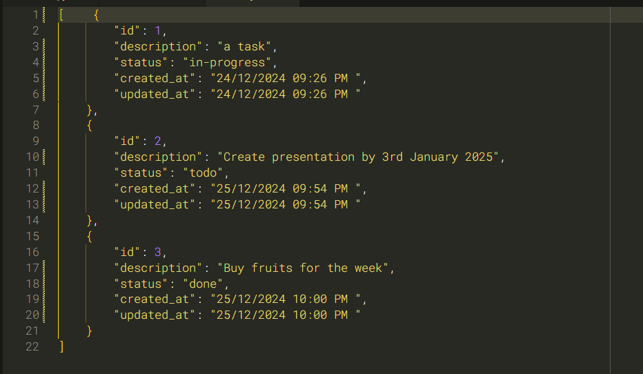

# CLI Task Tracker

This cli task tracker is a simple command-line app that allows users to add, update and delete tasks, as well as changing their status and listing tasks based on status. All tasks a stored in a json file.



## How to Run

```command-line
git clone github.com/SimonMably/CLI_Task_Tracker.git
cd project directory
```

Run the following examples (eg. from Command Prompt):

```command-line

# For help and a list of commands
task-cli.py -h or task-cli.py --help

# To add a new task
task-cli.py add "Write documentation for project."

[
    {
        "id":1,
        "description": "Write documentation for project.",
        "status": "todo",
        "created_at": "25/12/2024 09:54 AM ",
        "updated_at": "25/12/2024 09:54 AM "
    }
]

# Updating a task description
task-cli.py update 1 "Write the documentation for the project by 23/01/2025"

[
    {
        "id":1,
        "description": "Write the documentation for the project by 23/01/2025",
        "status": "todo",
        "created_at": "13/12/2024 09:54 AM ",
        "updated_at": "13/12/2024 10:24 AM "
    }
]

# Delete a task specified by its id
task-cli.py delete 1

# Update a tasks status - todo, in-progress or done
task-cli.py mark done 1

[
    {
        "id":1,
        "description": "Write the documentation for the project by 23/01/2025",
        "status": "done",
        "created_at": "13/12/2024 09:54 AM ",
        "updated_at": "14/12/2024 12:45 PM "
    }
]

# List tasks by status: all, todo, in-progress and done
task-cli.py list or task-cli.py list all
task-cli.py list or todo
task-cli.py list in-progress
task-cli.py list done

Using the 'all' argument (or leaving the arguments as blank) will print all tasks in the console.
Using any of the other arguments will print all of the respective tasks in the console.
```

A CLI task tracker made with Python 3.11.

The idea for this project came from [roadmap.sh](https://roadmap.sh/projects/task-tracker)
